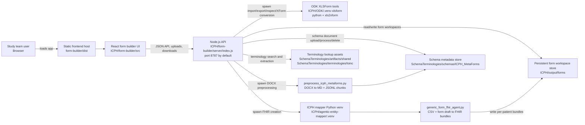
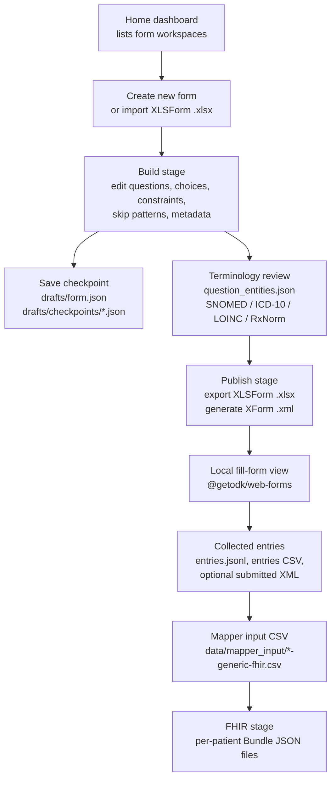

# ICPH Local Form-To-FHIR Architecture

This document describes the current deployable ICPH folder flow.

The application is a local web app with a React frontend, a Node.js API, and two
Python toolchains invoked as subprocesses. State is stored on the filesystem;
there is no database in the current implementation.

## Runtime Topology



## User And Data Lifecycle



Approved terminology mappings are consumed during the FHIR stage. The mapper
adds admin-validated SNOMED CT, LOINC, ICD-10, and RxNorm codings to generated
FHIR question definitions; suggestions that were not approved by the admin are
not used.

The current terminology extractor is a lightweight rules/lookup script rather
than an LLM agent. The admin can add missed entities manually in the Terminology
tab; manually added entities follow the same approval/unmapped-review flow as
automatically extracted entities.

## Persistent Storage Layout

Each form gets its own workspace folder under `ICPH/output/forms`.

```text
ICPH/output/forms/<workspace-id>/
  drafts/
    form.json
    checkpoints/
      <timestamp>.json
  attachments/
    <uploaded media or companion files>
  terminology/
    question_entities.json
  xlsform/
    <form-id>.xlsx
  xml/
    <form-id>.xml
  data/
    entries.jsonl
    <form-id>_entries.csv
    <entry-id>.xml
    mapper_input/
      <form-id>-generic-fhir.csv
  fhir_bundles/
    mapper_result.json
    <patient-id>-<hash>_<form-id>.json
  logs/
```

Schema metadata documents are stored separately because they are shared context
for later FHIR mapping/review, not per-form submissions.

```text
ICPH/agentic-entity-mapper/SchemaTerminologies/schemas/ICPH_MetaForms/
  originalDocx/
    <uploaded-schema-document>.docx
  processedMD/
    <document>.md
    <document>.chunks.jsonl
    icph_metaform_chunks.jsonl
    icph_metaforms_manifest.json
```

Terminology lookup assets are intentionally pruned to the assets used by the
current UI:

```text
ICPH/agentic-entity-mapper/SchemaTerminologies/
  artifacts/shared/
    snomed_ct/<version>/lookups/snomed_ct_lookup.csv
    icd10/<version>/lookups/icd10_lookup.csv
    rxnorm/<version>/lookups/rxnorm_metadata.json
  terminologies/loinc/<version>/LoincTable/Loinc.csv
```

## Main Runtime Processes

| Process | Command | Purpose |
| --- | --- | --- |
| Frontend dev server | `npm run client` | Vite dev frontend on port `5173`. |
| API server | `ICPH_FORM_BUILDER_API_PORT=8787 npm run server` | Node API that owns workspace files and subprocess orchestration. |
| Production frontend build | `VITE_FORM_BUILDER_API=<api-url> npm run build` | Builds static frontend into `ICPH/form-builder/dist`. |
| Mapper checks | `./.venv/bin/python -m unittest discover tests` | Smoke checks for generic FHIR bundle generation. |

For production, serve `ICPH/form-builder/dist` from a static web server or
reverse proxy, and run `node server/index.js` as the backend API service.

## External/Internal Dependencies

- Node.js runtime for the API and React/Vite build.
- Python environment at `ICPH/ODK/.venv-xlsform` containing XLSForm tooling,
  especially `xls2xform`.
- Python environment at `ICPH/agentic-entity-mapper/.venv` containing
  `markitdown[docx]` for schema preprocessing.
- Browser-side `@getodk/web-forms` renders published XForms and returns local
  submissions.
- No ODK Central service is required for the current local flow.
- No database, message queue, or object storage is currently used.

## Deployment Notes

- `ICPH/output/forms` must be persistent and writable by the Node API process.
- `SchemaTerminologies/schemas/ICPH_MetaForms/originalDocx` and `processedMD`
  must be writable if users will upload/process schema metadata documents.
- Terminology lookup assets can be mounted read-only after deployment.
- The Node API currently sets permissive CORS headers. For production, restrict
  this at the reverse proxy or in `server/index.js`.
- The UI does not implement login/authentication. Put it behind the institution's
  normal authentication, VPN, or trusted network boundary.
- Uploaded XLSX, DOCX, attachments, entries, XML, CSV, and FHIR JSON files live
  on disk. Backups should include `ICPH/output/forms` and any schema metadata
  folders that users modify.
- Current FHIR generation is per form workspace and groups submitted rows by
  the selected primary identifier. Cross-form, study-wide patient bundle
  aggregation should be added as a separate service/job if the deployment needs
  one patient bundle spanning multiple form workspaces.

## Health And Smoke Checks

```bash
cd ICPH/form-builder
node --check server/index.js
npm run build
ICPH_FORM_BUILDER_API_PORT=8787 npm run server
curl http://127.0.0.1:8787/api/health
```

```bash
cd ICPH/agentic-entity-mapper
./.venv/bin/python -m py_compile generic_form_fhir_agent.py preprocess_icph_metaforms.py
./.venv/bin/python -m unittest discover tests
```
