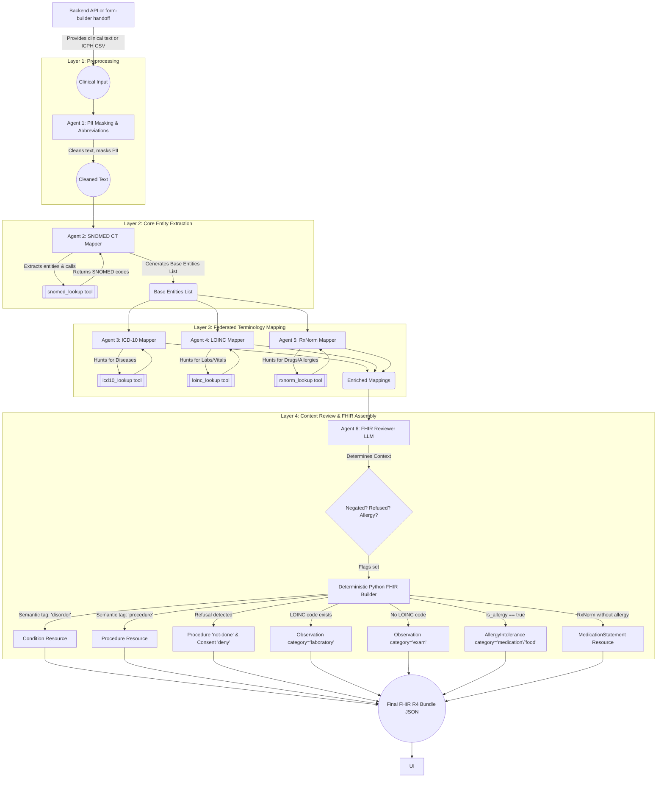

# Agentic Entity Mapper & FHIR Pipeline
*A simple guide to how our AI pipeline reads clinical text and turns it into standardized medical data.*

## Overview

When a doctor writes a clinical note, it is filled with unstructured text like *"Patient denies chest pain but has a severe peanut allergy. Scheduled for a screening colonoscopy."* 

Our system uses a **team of specialized AI Agents**, each acting like an expert medical coder for a different dictionary (Ontology). They work together to read the text, extract the medical concepts, and package them into a universal standard format called a **FHIR Bundle** (Fast Healthcare Interoperability Resources).

---

## The Workflow Flowchart

---

## Meet the Agents

Think of the agents as a team of specialists sitting in a room, passing a clipboard around.

### 1. The PII & Abbreviation Agent (The Prep Cook)
- **What it does:** Runs before anything else. It reads the raw text, redacts sensitive Personal Identifiable Information (PII) like names and dates, and expands medical abbreviations (e.g., changing "HTN" to "Hypertension").
- **Role:** Ensures the text is clean, private, and standardized before the medical coders see it.

### 2. The SNOMED CT Agent (The Generalist)
- **What it does:** Reads the cleaned text first. SNOMED CT is the most massive, comprehensive dictionary in medicine. 
- **How it searches:** It uses a semantic AI search. It converts the medical text into mathematical vectors using a local **BERT Transformer model** and searches a massive **FAISS Vector Database** to find the closest conceptual matches. If the primary agent loop fails to gather mappings, an **LLM Generalization Fallback** runs to extract entities and execute searches deterministically as a safety net.
- **Tool:** `snomed_lookup`
- **Role:** Extracts all the core concepts—diseases, body parts, procedures, and symptoms. It acts as the "base layer" of our extraction.

### 3. The ICD-10 Agent (The Biller/Diagnostician)
- **What it does:** Looks specifically for **Diseases and Conditions**. 
- **How it searches:** Similar to SNOMED, it uses **FAISS Vector Search + BERT embeddings** to semantically match conditions to their official ICD-10 billing codes.
- **Tool:** `icd10_lookup`
- **Role:** It ignores things like medications or lab tests and focuses purely on finding the billing/diagnostic codes for conditions (e.g., Asthma, Heart Attack).

### 4. The LOINC Agent (The Lab Tech)
- **What it does:** Looks specifically for **Lab Tests, Vital Signs, and Imaging Studies**.
- **How it searches:** It uses **Pandas DataFrame string matching** (Exact matches + Regex) against a local CSV, followed by a custom heuristic scoring system based on clinical overlap. If it fails to find a match, it uses an **LLM Generalization Fallback** to convert slang into standard lab terms (e.g., "kidney test" -> "renal panel") and tries again.
- **Tool:** `loinc_lookup`
- **Role:** It strictly avoids clinical procedures (like a colonoscopy) because those belong in SNOMED. Instead, it focuses on measurable things, like a Complete Blood Count (CBC) or a Heart Rate measurement.

### 5. The RxNorm Agent (The Pharmacist)
- **What it does:** Looks specifically for **Medications and Drugs**.
- **How it searches:** It also relies on **Pandas string matching + Regex** on a localized database, combined with heuristic scoring. It utilizes an **LLM Generalization Fallback** to translate brand names or slang into standard US generic medications (e.g., "Advil" -> "ibuprofen") before searching.
- **Tool:** `rxnorm_lookup`
- **Role:** It identifies drugs (like Aspirin, Tylenol) and standardizes them. If a patient is allergic to a drug, RxNorm provides the precise code for it.

### 6. The FHIR Bundle Agent (The Architect)
- **What it does:** Takes the messy clipboard full of codes from the other four agents and builds the final, structured JSON document.
- **Role:** It does two main things:
  1. **Context Review:** An LLM reads the text one last time to figure out *context*. Was a procedure **refused**? Is a symptom **denied** (negated)? Is the patient **allergic** to the medication?
  2. **Deterministic Building:** A strict Python script builds the FHIR JSON based on the rules.

---

## Minute Details Justified (Why do we do this?)

### Why do we merge codes instead of keeping them separate?
If the patient had a "Heart Attack", SNOMED might code it as `Myocardial Infarction`, and ICD-10 might code it as `I21.9`. Instead of creating two separate records, the FHIR Agent **merges** both codes into a single `Condition` resource. This is best practice in FHIR: One event = One resource (with multiple terminology translations attached).

### What is the difference between "Exam" and "Laboratory" Categories?
In FHIR, an `Observation` resource requires a category. 
- **"exam"**: When a doctor writes down a physical finding or a symptom (like "patient has a headache" or "abdomen is tender"), we map it to an Observation with the category `"exam"`. This tells any downstream medical system: *"This observation was found during a standard clinical examination or patient interview."*
- **"laboratory"**: If the entity was successfully mapped by the LOINC agent, the FHIR Builder dynamically switches the category to `"laboratory"`. LOINC codes explicitly represent clinical measurements and lab tests, so they belong in the laboratory category!

### How do we handle Allergies like "Peanuts and Aspirin"?
If the text says the patient is allergic to a medication (Aspirin), RxNorm will tag it and the builder assigns the `"medication"` category. For food/environmental allergies (like "Peanuts") that happen to also map to a medication extract in RxNorm (e.g., "peanut allergenic extract"), our pipeline is smart enough to generate **two** resources:
1. A pure `"food"` allergy resource containing only the SNOMED code.
2. A separate `"medication"` allergy resource containing the RxNorm extract code.
This ensures precise clinical accuracy without mixing food terminology with medication terminologies.

### How do we handle "Refused" or "Negated" things?
If a patient *denies* having chest pain, we don't want to accidentally diagnose them with chest pain! 
- For **Conditions** (like Chest Pain): We add a special `verificationStatus` of `refuted` and a SNOMED code for "Negative".
- For **Procedures** (like a Colonoscopy the patient refused): We follow strict FHIR guidelines by generating **two** resources: a `Consent` resource with a provision type of `deny`, and a `Procedure` resource with a status of `not-done`. We also map the exact SNOMED "Procedure refused (situation)" code to accurately capture the refusal.
